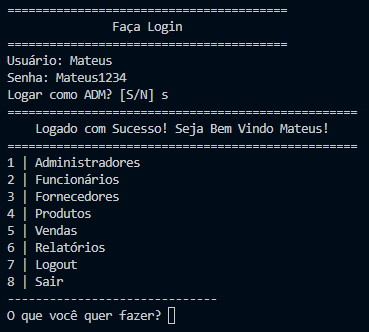
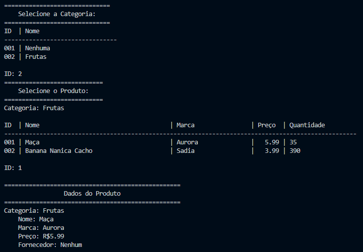
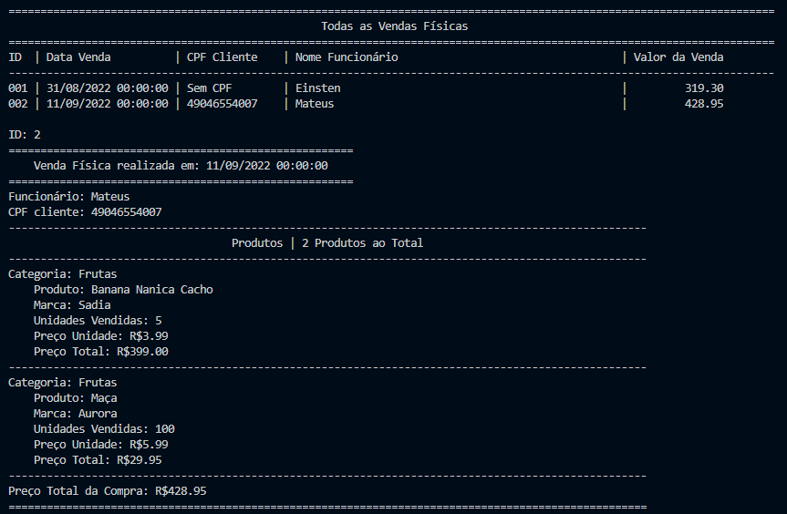

# Software de Gerenciamento de Merceária

Um software usado para gerenciar uma merceária, usado tantos pelos funcionários quanto pelos clientes. 💻

Conta com uma interface pelo terminal, com várias opções enumeradas para o usuário escolher. 😀

---

Os funcionários são dividos em ADMs, que podem cadastrar outros funcionários, alterar, remover, gerar os relatórios...; funcionários comuns que podem gerenciar os produtos e fazer as vendas.

A parte dos clientes é feita somente pelo site, onde ele pode se cadastrar, logar, escolher os seus produtos e fazer a venda.

---
## Funções

O software possui as seguintes funcionalidades:

- Cadastro / Alteração / Remoção:
    - Categoria
    - Produto
    - Fornecedor
    - Funcionário
    - Cliente
- Relatórios
    - Vendas geral ou por datas
    - Funcionários que mais venderam
    - Produtos que mais venderam
    - Produtos vencidos
- Validações
    - Nome
    - Email
    - Telefone
    - CPF
    - CNPJ
- Hash das senhas para armazenamento
- Controle de validade dos produtos

---
## Técnico

- Python - 3.10.2

- Interface - Terminal Windows

- Banco de Dados - JSON

- Bibliotecas:
    - json
    - datetime
    - bcrypt

- Estrutura:
    - Model - Classes
    - Views - Interface do usuário
    - Controller - Interações e validações
    - Dal - Interações com o banco de dados

 

